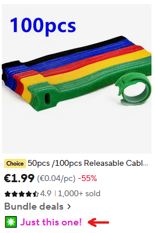

# Skip AliExpress Bundle Deals: Just This One!

A userscript that adds direct **"Just this one!"** links on AliExpress, letting you buy a single product instead of being forced into bundle deals.

Inspired by the Chrome extension **"Skip AliExpress Bundle Deals: Just This One!"** by [johnnyaug](https://github.com/johnnyaug). This userscript is a clean-room recreation of its core functionality, but without analytics and affiliate-link rewriting. This project is not affiliated with the Chrome extension.

Works with **Tampermonkey**, **Greasemonkey**, and **Violentmonkey** on Chrome, Firefox, and other browsers.

## What it does

AliExpress often pushes bundle deals where you can only buy multiple items together. This script detects those bundle offers and injects a direct link to the individual product page underneath them.

It works in three places on AliExpress:

|Page|Behavior|
|---|---|
|**Search results**|Finds bundle-deal links and adds a direct product link|
|**Wishlist**|Adds direct product links to wishlisted items|
|**Bundle Deals page** (`/BundleDeals2`)|Adds direct product links to each bundled item|

Clicking a **"Just this one!"** link opens the individual product page in a new tab.

## Installation

1. Install a userscript manager:
    - [Tampermonkey](https://www.tampermonkey.net/) (Chrome, Firefox, Edge, Safari)
    - [Greasemonkey](https://www.greasespot.net/) (Firefox)
    - [Violentmonkey](https://violentmonkey.github.io/) (Chrome, Firefox, Edge)
2. Open the [raw userscript](https://raw.githubusercontent.com/qubitstream/aliexpress-no-bundle-deals-just-this-one/main/aliexpress-no-bundle-deals-just-this-one.user.js) and confirm the installation in your userscript manager.
3. Refresh any open AliExpress tabs.

### Chrome setup

Recent Chrome versions require an extra extension setting for userscripts. If the script does not run in Chrome, open `chrome://extensions`, select your userscript manager, and enable **Allow User Scripts**. Tampermonkey may also prompt you to enable this from its dashboard.

## How it works

- Injects CSS and scans the DOM for bundle-deal elements using selectors and a product-ID regex.
- A `MutationObserver` re-runs the scan whenever AliExpress dynamically loads new content.
- Uses `GM_openInTab` (cross-browser userscript API) to open product pages, bypassing popup blockers.

## License

[MIT License](LICENSE)
